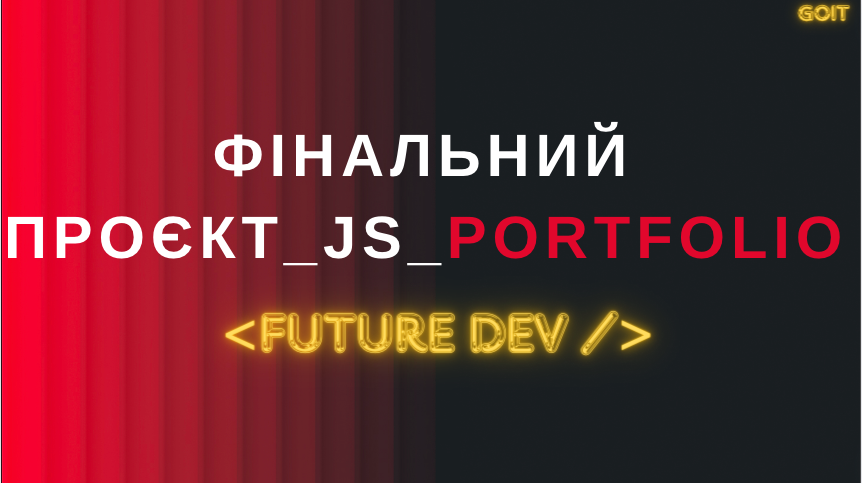
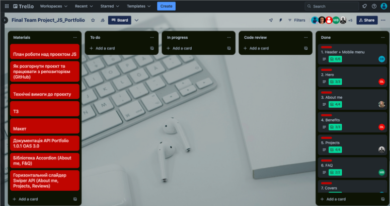
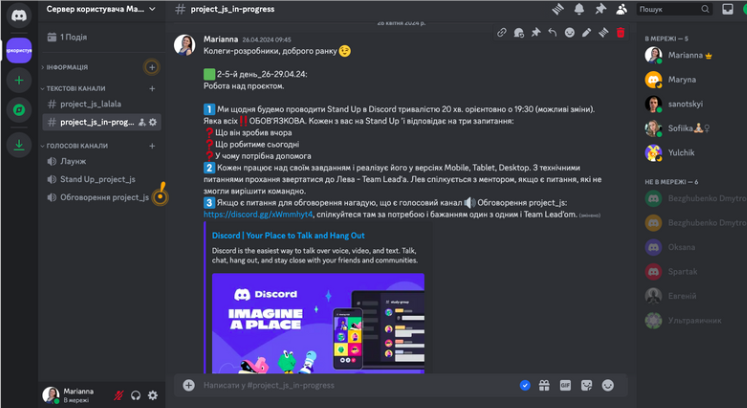
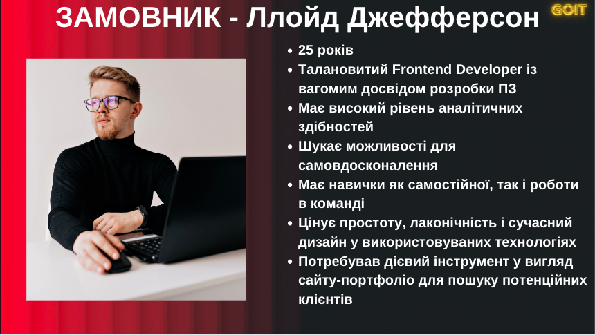
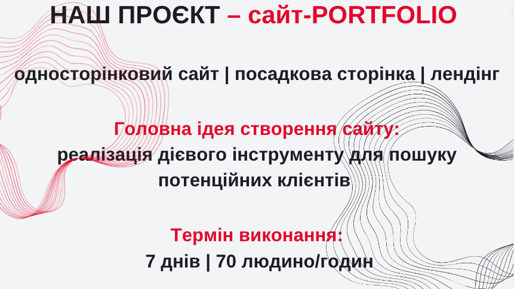
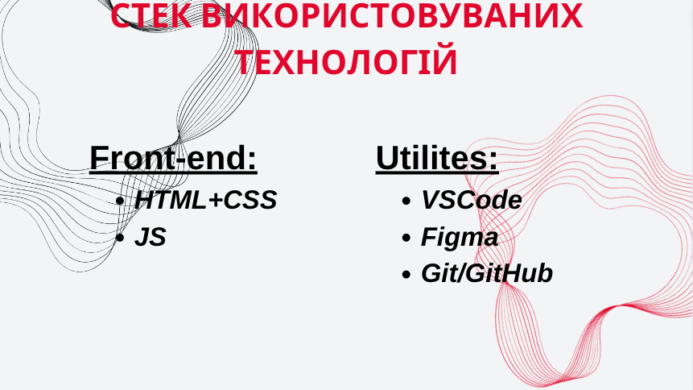
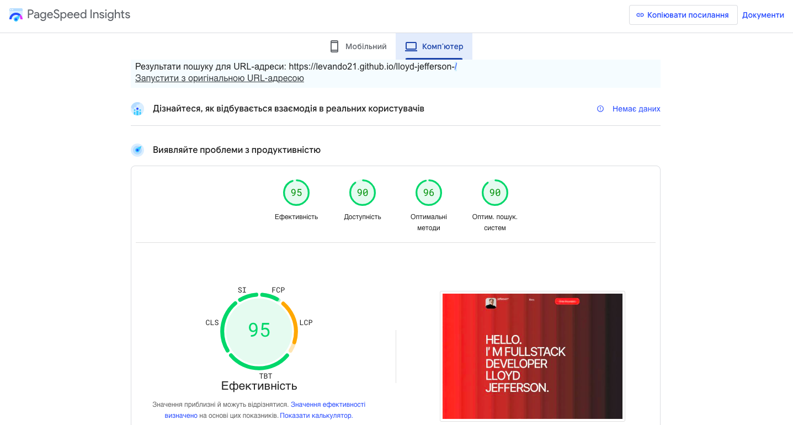

# Future Developers Portfolio

Даний фінальний проєкт з курсу JS під назвою Portfolio, реалізований нашою
командою майбутніх розробників, яка символічно обрала собі назву <FUTURE DEV />
(тобто, future developers). 

## Команда

...

## Організація роботи

Для організації роботи над створенням проєкту було використано дошку Final Team
Project_JS_Portfolio в Trello:
[Final Team Project_JS_Portfolio](./src/img/readme/trello.png)

## Комунікація

Для ефективної текстової і голосової комунікації було створено 2 текстові канали
та 2 голосові (у одному з ним, ми проводили щоденні `Stand Upʼu`, в іншому при
необхідності кожен учасник міг комунікувати між собою і Team Leadʼom).

## Замовник

Сайт було виконано на запит потенційного замовника (нижче його короткий
профіль):

## Результат

В результаті спільної роботи ми створили сайт Portfolio:

## Використані технології

Стек технологій, використаний при створенні проєкту:

## Готовий проєкт

[Наш готовий проєкт - сайт Portfolio](https://levando21.github.io/lloyd-jefferson-/)

## Неader+mobile menu

`В Header-і знаходиться logo, навігація по сайту та посилання "Order the project" Logo складається з контентного зображення та напису. Навігація по сайту для планшетних і десктопних пристроїв має зʼявлятись і приховуватись по clickу на Menu, і реалізована якірними посиланнями, які ведуть до відповідних секцій сайту з застосуванням повільного скролу. "Order the project" перенаправляє користувача до секції Work together. Для мобільних пристроїв навігація розміщена в меню, взаємодія з яким реалізована за допомогою JS. По clickу на кнопку-іконку з бургер-меню, меню плавно зʼявляється і заповнює всю ширину та висоту в'юпорту пристрою користувача. У разі clickу по елементу навігації, користувач перенаправляється до відповідної секції сайту. Меню закривається по clickу на кнопку-іконку закриття.`

## Hero

`Текст “Hello. I’m Fullstack developer Lloyd Jefferson.” є головним заголовком сайту. Секція містить перелік посилань на соц. мережі, який реалізований як список елементів за допомогою , що відкривають у новій вкладці сторінку GoIT відповідної соц. мережі. При натисканні на іконку GitHub - відкривається посилання на проєкт команди, розміщений на GitHub; контактний email, реалізувваний за допомогою протоколів посилання.`

## About me

`У секції немає видимого заголовку. Зроблений прихований заголовок для
краулерів.

Секція містить описову частину та зображення, яке реалізувано як контентне.
Інформація про себе, свій досвід і освіту реалізувано за допомогою і бібліотеки
Accordeon як список елементів, що розкриваються або закриваються по clickу на
елемент в залежності від його стану. За замовчуванням перший елемент списку має
бути розкритим.

Перелік навичок відтворено за допомогою у вигляді горизонтального слайдера
Swiper API.

Користувач має змогу взаємодіяти зі слайдером через мишу, клавіатуру (клавіш Tab
та стрілок) або сенсорний екран. По clickу праворуч (або відповідно до
зазначеного напрямку), у разі досягнення кінця списку елементів, наступний click
відображає перший/останній елемент. Така функціональність дозволяє користувачеві
продовжувати переглядати елементи безкінечно, переходячи з одного кінця до
іншого без переривання.`

## Benefits

`Текст “Benefits of working with me” є заголовком секції. У секції знаходиться перелік переваг, який реалізувано як список елементів за допомогою. "Order the project" слід створено як якірне посилання, яке перенаправляє користувача до секції Work together.`

## Projects

`Текст “Projects” є заголовком секції. Перелік проєктів та опису до них реалізувано за допомогою <ul> у вигляді горизонтального слайдера (Swiper API ). Користувач має змогу взаємодіяти зі слайдером через мишу, клавіатуру (клавіш Tab та стрілок) або сенсорний екран. У разі досягнення кінця списку елементів, кнопка відповідно до вказаного напрямку стає задізейбленою (користувач більше не може взаємодіяти з нею, і вона не реагує на події clickу або натискання клавіші). Задізейблена кнопка візуальною змінюється, що підкреслює її неактивний стан. Посилання "See project" відкриває проєкт команди, розміщений на GitHub, у новій вкладці.`

## F&Q

Текст “FAQ" є заголовком секції. Перелік популярних запитань необхідно
реалізувано за допомогою і бібліотеки Accordeon як список елементів, що
розкриваються або закриваються по clickу на елемент в залежності від його стану.
За замовчуванням, всі елементи списку мають бути закритими.

## Covers

`У секції немає видимого заголовку. Зроблений прихований заголовок для
краулерів.

Перелік обкладинок створено за допомогою. Перелік реалізовано у вигляді рядків,
що біжать. За допомогою JS така анімація спрацьовує лише за наявності секції
"Covers" всередині viewportа користувача.

Фон слід відтворено за допомогою фонового зображення формату png та радіальних
градієнтів. Reviews

Текст “Reviews" є заголовком секції.

Перелік відгуків відтворено за допомогою у вигляді горизонтального слайдера
(Swiper API ). Користувач має змогу взаємодіяти зі слайдером через мишу,
клавіатуру (клавіш Tab та стрілок) або сенсорний екран. У разі досягнення кінця
списку елементів, кнопка відповідно до вказаного напрямку повинна бути
задізейблена (користувач більше не може взаємодіяти з нею, і вона не реагує на
події clickу або натискання клавіші). Задізейблена кнопка візуальною змінюється,
що підкреслює її неактивний стан.
Перелік відгуків отримуємо з backendа. Якщо з
сервера буде повернута помилка - користувачеві про це буде повідомлено за
допомогою вспливаючого повідомлення, а замість переліку відгуків відмалюється
текст-заглушку "Not found".`

## Work+together

`Текст “Let’s work together" є заголовком секції.

Секція також містить форму, що включає обовʼязкові до заповнення елементи
<input> та кнопку “Send" типу submit. Полю для введення електронної пошти додано
мінімальну валідацію введених даних за допомогою атрибуту
pattern="^\w+(.\w+)?@[a-zA-Z_]+?.[a-zA-Z]{2,3}$". У випадку, коли вміст
введеного тексту перевищує розмір поля input, відображується тільки обмежена
кількість символів, а решта тексту позначається трьома крапками (...), що
показує, що текст був обрізаний.
По clickу на кнопку "Send" відправляється POST
запит на сервер про створення заявки щодо співпраці та у разі успішного
створення - відкривається відповідне модальне вікно, в цьому випадку слід також
очистити форму. Якщо з сервера буде повернута помилка - користувач буде
повідомлений за допомогою вспливаючого повідомлення.

Контактний номер телефону та email необхідно реалізовано за допомогою протоколів
посилання. Modal window

Текст “Thank you for your interest in cooperation!" є заголовком модального
вікна.

Модальне вікно також містить описову частину та кнопку-іконку закриття.

Модальне вікно закривається по clickу на кнопку-іконку закриття, по clickу на
backdrop, а також натисканню на клавішу Escape.`

## PageSpeed

[Проєкт пройшов оцінювання на PageSpeed Insights](https://pagespeed.web.dev/analysis/https-levando21-github-io-lloyd-jefferson-/cur46ud9u9?form_factor=desktop)

## Висновок

Ми створили не просто проєкт, а також прокачали важливий soft skill - роботи в
команді, яка полягала в прагненні, не тільки вчасно закривати власні задачі, а й
прийти на допомогу з дієвими порадами і підказками іншим.
